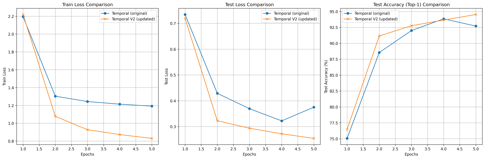
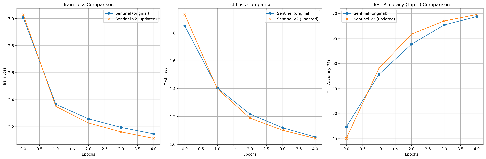

# Experimental Results

This document presents the performance comparisons between the original and updated versions of the temporal and sentinel models. The results include key metrics such as training loss, test loss, and test accuracy (Top-1) for both datasets. Visualizations of the results are also provided for clarity.

---

## Temporal Model

The following sections compare the performance of the original `temporal` model and its updated version `temporal_v2`, based on the fMoW Temporal dataset.

### Temporal Configuration
- **Model**: `vit_large_patch16`
- **Model Type**: `temporal`
- **Dataset**: `fmow`
- **Batch Size**: `4`
- **Sequence Size**: `3`
- **Epochs**: `5`
- **No. Workers**: `4`
- **Mixup**: `True`

### Temporal V2 Configuration
- **Model**: `vit_large_patch16`
- **Model Type**: `temporal_v2`
- **Dataset**: `fmow`
- **Batch Size**: `1`
- **Sequence Size**: `8`
- **Epochs**: `5`
- **No. Workers**: `4`
- **Mixup**: `False`

### Performance Comparison
| Metric          | Temporal       | Temporal V2 | Improvement       |
|-----------------|----------------|-------------|-------------------|
| Training Loss   | 1.1917         | 0.8301      | ↓ 0.3616 (30.34%) |
| Test Loss       | 0.3752         | 0.2543      | ↓ 0.1209 (32.22%) |
| Test Accuracy (Top-1) | 92.7079% | 94.5310%    | ↑ 1.8231%         |

**Analysis**: The `temporal_v2` model shows significant improvements over the original `temporal` model. The training loss decreased by 30.34%, and the test loss reduced by 32.22%. Additionally, the Top-1 test accuracy improved by 1.82%, indicating better generalization on the fMoW Temporal dataset.

### Results Visualization

---

## Sentinel Model (Multi-Spectral)

The following sections compare the performance of the original `sentinel` model and its updated version `sentinel_v2`, based on the fMoW-Sentinel dataset.

### Sentinel Configuration
- **Model**: `vit_base_patch16`
- **Model Type**: `group_c`
- **Dataset**: `fmow-sentinel`
- **Batch Size**: `32`
- **Epochs**: `5`
- **No. Workers**: `4`
- **Dropped Bands**: `0, 9, 10`

### Temporal V2 Configuration
- **Model**: `vit_base_patch16`
- **Model Type**: `group_c_v2`
- **Dataset**: `fmow-sentinel`
- **Batch Size**: `32`
- **Epochs**: `5`
- **No. Workers**: `4`
- **Dropped Bands**: `0, 9, 10`

### Performance Comparison
| Metric          | Sentinel       | Sentinel V2 | Improvement       |
|-----------------|----------------|-------------|-------------------|
| Training Loss   | 2.1468         | 2.1131      | ↓ 0.0337 (1.57%)  |
| Test Loss       | 1.0523         | 1.0422      | ↓ 0.0102 (0.97%)  |
| Test Accuracy (Top-1) | 69.3644% | 69.7712%    | ↑ 0.4068%         |

**Analysis**: The `sentinel_v2` model demonstrates modest improvements over the original `sentinel` model. The training loss decreased by 1.57%, and the test loss reduced by 0.97%. The Top-1 test accuracy improved by 0.41%, suggesting performance gains on the fMoW-Sentinel dataset.

### Results Visualization

---

## Acknowledgements

The baseline models and weights are sourced from the **SatMAE repository**: [https://github.com/sustainlab-group/SatMAE](https://github.com/sustainlab-group/SatMAE). The results presented here build upon the pretrained and finetuned weights provided in the original repository.